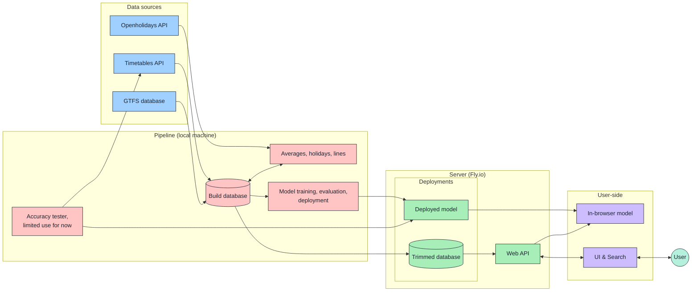

# dbrel / BahnPredict — general structure

```mermaid
flowchart LR
  subgraph SRC["Data sources"]
    TT["Timetables API"]
    GT["GTFS database"]
    OH["Openholidays API"]
  end

  subgraph PIPE["Pipeline (local machine)"]
    ACC["Accuracy tester,<br/>limited use for now"]
    BDB[("Build database")]
    AVG["Averages, holidays, lines"]
    TRAIN["Model training, evaluation,<br/>deployment"]
  end

  subgraph SERVER["Server (Fly.io)"]
    subgraph DEP["Deployments"]
      DM["Deployed model"]
      TDB[("Trimmed database")]
    end
    API["Web API"]
  end

  subgraph CLIENT["User-side"]
    BM["In-browser model"]
    UI["UI & Search"]
  end

  USER(("User"))

  TT --> BDB
  GT --> BDB
  OH --> AVG
  ACC --> TT
  BDB <--> AVG
  BDB --> TRAIN
  BDB --> TDB
  TRAIN --> DM
  ACC --> DM
  TDB --> API
  DM --> BM
  API --> BM
  API <--> UI
  UI <--> USER

  classDef source fill:#9fd0ff,stroke:#1b2430,color:#1b2430
  classDef pipe fill:#ffc4c4,stroke:#1b2430,color:#1b2430
  classDef deploy fill:#a8eeb8,stroke:#1b2430,color:#1b2430
  classDef client fill:#cdbdff,stroke:#1b2430,color:#1b2430
  classDef person fill:#b4f0dc,stroke:#1b2430,color:#1b2430
  class TT,GT,OH source
  class ACC,BDB,AVG,TRAIN pipe
  class DM,TDB,API deploy
  class BM,UI client
  class USER person
```
