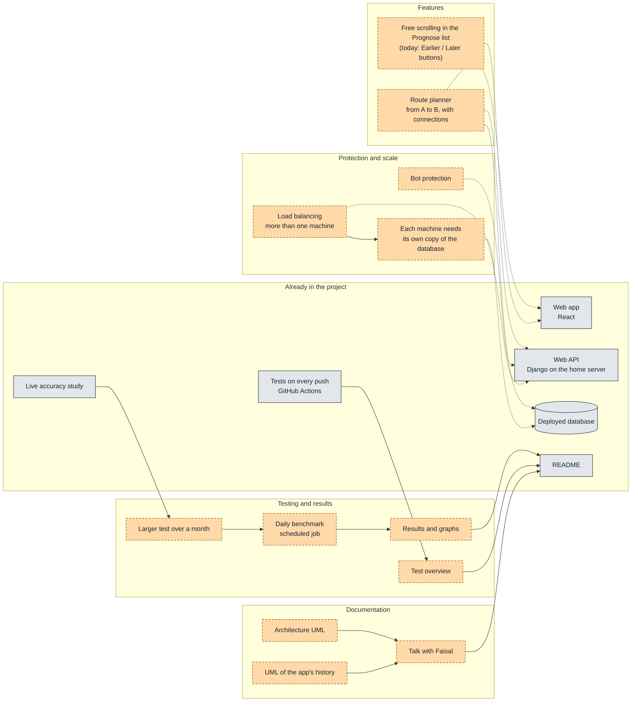

# Remaining work

```mermaid
flowchart LR
  subgraph NOW["Already in the project"]
    APP["Web app<br/>React"]
    API["Web API<br/>Django on the home server"]
    DDB[("Deployed database")]
    STUDY["Live accuracy study"]
    CI["Tests on every push<br/>GitHub Actions"]
    README["README"]
  end

  subgraph FEAT["Features"]
    PLAN["Route planner<br/>from A to B, with connections"]
    SCROLL["Free scrolling in the Prognose list<br/>(today: Earlier / Later buttons)"]
  end

  subgraph OPS["Protection and scale"]
    BOT["Bot protection"]
    LB["Load balancing<br/>more than one machine"]
    COPY["Each machine needs<br/>its own copy of the database"]
  end

  subgraph TEST["Testing and results"]
    MONTH["Larger test over a month"]
    DAILY["Daily benchmark<br/>scheduled job"]
    GRAPHS["Results and graphs"]
    TESTSHOW["Test overview"]
  end

  subgraph DOCS["Documentation"]
    UMLA["Architecture UML"]
    UMLH["UML of the app's history"]
    FAISAL["Talk with Faisal"]
  end

  PLAN -.-> APP
  PLAN -.-> API
  PLAN -.-> DDB
  SCROLL -.-> APP
  BOT -.-> API
  LB -.-> API
  LB --> COPY
  COPY -.-> DDB

  STUDY --> MONTH --> DAILY --> GRAPHS --> README
  CI --> TESTSHOW --> README

  UMLA --> FAISAL
  UMLH --> FAISAL
  FAISAL --> README

  classDef have fill:#e3e7ec,stroke:#1b2430,color:#1b2430
  classDef todo fill:#ffd9a8,stroke:#8a4b00,stroke-dasharray:5 3,color:#1b2430
  class APP,API,DDB,STUDY,CI,README have
  class PLAN,SCROLL,BOT,LB,COPY,MONTH,DAILY,GRAPHS,TESTSHOW,UMLA,UMLH,FAISAL todo
```
